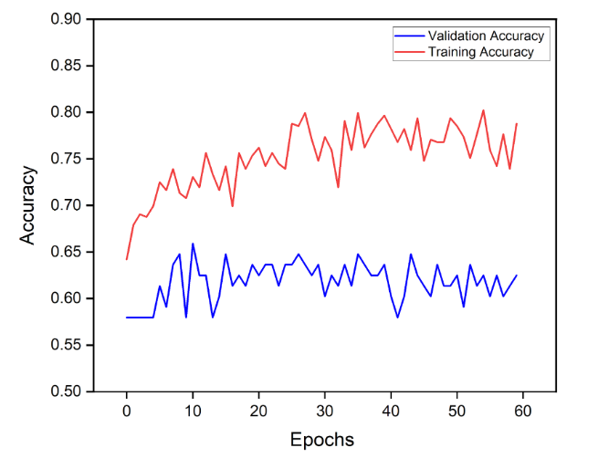

# Alzheimers-dementia-recognition-through-spontaneous-speech
Detect dementia by capturing the acoustic features of subjects through audio and automatic speech recognition technology, classify using Deep Learning techniques

- [Alzheimer's Dementia Recognition through Spontaneous Speech](#alzheimers-dementia-recognition-through-spontaneous-speech)
  - [1. Problem Definition](#1-problem-definition)
  - [2. Data Collection](#2-data-collection)
  - [3. Data Processing](#3-data-processing)
  - [4. Data Preparation](#4-data-preparation)
  - [5. Deep Learning Model](#5-deep-learning-model)
  - [6. Architecture Design and Model Training](#6-architecture-design-and-model-training)
  - [7. Model Evaluation](#7-model-evaluation)

### 1. Problem Definition
* Most of the studies on Alzheimer's disease (AD) have been carried out using medical images.However, the acquisition of medical images data is difficult.
* The identification based on the patient's speech data can effectively reduce the medical cost, and the speech data can be collected
in a non-invasive manner so that the patient's data can be collected in real-time and accurately.
* This project uses a new method that uses the spectrogram features extracted from speech data to identify AD, which can help families to understand the disease development of patients in an earlier stage
* One of the earliest areas of the brain affected by Alzheimer's disease is the region responsible for processing language abilities.

  

### 2. Data Collection
* ADReSS (Alzheimer’s Dementia Recognition through Spontaneous Speech) Challenge dataset is used.
* Interviews on The Cookie Theft Picture from the Boston Diagnostic Aphasia Examination.

  

* For the PD task, the examiner asks subjects to describe the picture by saying, "Tell me everything you see going on in this picture". Then subjects response is recorded
### 3. Data Processing
* Distribution - 86 ad subjects , 78 normal subjects
* Problems in audio data- 
    * Few interview audio samples are noisy - either static or sudden noises are present
    * Some audio samples are very feeble in sound
    * Sometimes interviewer enters the conversation to help the subject or continue the conversation, those parts have to be removed
* Dealing with above problems - 
    * Using Audacity software, interviewer parts are removed manually
    * Noise removal - used Python library "noisereduce" to remove stationary and non-stationary noises 
* Length of each interview varies with subject - To overcome this issue, each interview is split using window size of 20 sec and labelled carefully
### 4. Data Preparation
* Acoustic features are used to classify subjects for AD (Alzheimers dementia)
* Each audio sample is divided into blocks of 20 second length, to improve time resolution further upsampled to 1-second blocks
* Cepstral coefficients logmel, MFCC, GFCC , BFCC are extracted from each audio sample, Then derivatives of each cepstral are computed.
* MFCC - Mel-frequency cepstral coefficients, GFCC - Gammatone Frequency Cepstral Coefficients , BFCC - Bark Frequency Cepstral Coefficients
* AD effects language and speech abilities of patient - pateient tends to hum,take time, forget the sequence of words while talking. These features are effectively captured using Cepstral encodings.

<!-- Spectrogram images added -->

  

  

### 5. Deep Learning Model
* Spectrogram of each audio sample, along with its first and second order derivatives can be given as a 3-channel RGB like input to the Efficientnet model.
* State-of-the-art **EfficientNet B0 model** with frozen ImageNet weights  is used for feature extraction.
* Additionally modifications have been done to the Efficientnet-B0 model by adding the pooling layer with dropout normalization which is connected to a dense layer with softmax activation.

### 6. Architecture Design and Model Training
* Optimizer - Adamax with learning rate of 0.001 
* Loss - Binary Cross Entropy
* Batch size - 32
*  EfficientNet Model is trained for 60 epochs

### 7. Model Evaluation
Five fold cross validation of the model yielded a mean accuracy of 73% with 0.73 precision rate.

  

  

<!-- 
9. Model Compilation and Training

-->

