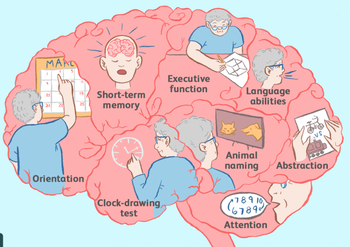

# Alzheimers-dementia-recognition-through-spontaneous-speech
Detect dementia by capturing the acoustic features of subjects through audio and automatic speech recognition technology, classify using Deep Learning techniques

### 1. Problem Definition
* Most of the studies on Alzheimer's disease (AD) have been carried out using medical images.However, the acquisition of medical images data is difficult.
* The identification based on the patient's speech data can effectively reduce the medical cost, and the speech data can be collected
in a non-invasive manner so that the patient's data can be collected in real-time and accurately.
* This project uses a new method that uses the spectrogram features extracted from speech data to identify AD, which can help families to understand the disease development of patients in an earlier stage
* Part of brain that processes language abilioties is one of the earliest parts influenced by Alzheimers

  

### 2. Data Collection
* ADReSS (Alzheimer’s Dementia Recognition through Spontaneous Speech) Challenge dataset is used.
* The Cookie Theft Picture from the Boston Diagnostic Aphasia Examination.

* For the PD task, the examiner asks subjects to describe the picture by saying, "Tell me everything you see going on in this picture". Then subjects response is recorded
### 3. Data Processing
* Distribution - 86 ad subjects , 78 normal subjects
* Problems in audio data- 
    * Few interview audio samples are noisy - either static or sudden noises are present
    * Some audio samples are very feeble in sound
    * Sometimes interviewer enters the conversation to help the subject or continue the conversation, those parts have to be removed
* Dealing with above problems - 
    * Using Audacity software, interviewer parts are removed manually
    * Noise removal - used Python library "noisereduce" to remove stationary and non-stationary noises 
* Length of each interview varies with subject - To overcome this issue, each interview is split using window size of 20 sec and labelled carefully
### 4. Data Preparation
* Acoustic features are used to classify subjects for AD (Alzheimers dementia)
* Cepstral coefficients MFCC, GFCC , CQCC are extracted from each 20sec-audio sample
* MFCC - Mel-frequency cepstral coefficients, GFCC - Gammatone Frequency Cepstral Coefficients , CQCC - Constant-Q Cepstral Coefficients
* AD effects language and speech abilities of patient - pateient tends to hum,take time, forget the sequence of words while talking. to capture these features temporally 
> Delta-MFCC, Double-Delta-MFCC features are extracted 
> 
7. Deep Learning Model
8. Model Architecture Design
9. Model Compilation and Training
10. Model Evaluation
